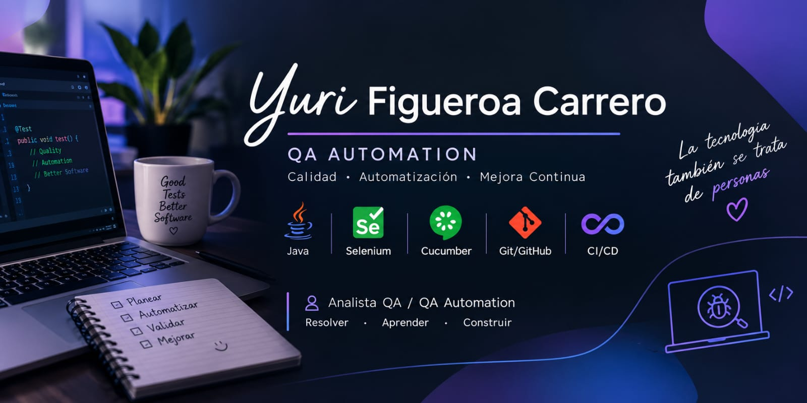

# ¡Hola! Soy Yuri Figueroa Carrero 🤝

Soy *QA Analyst / QA Automation*, con más de 3 años de experiencia en el área de Quality Assurance.

Llegué al testing por algo que siempre estuvo presente en mí: la curiosidad por entender cómo funcionan las cosas, cuestionarlas, encontrar errores y buscar formas de mejorarlas.

A lo largo de mi experiencia fui creciendo desde el testing manual y funcional hasta la automatización de pruebas, combinando una mirada analítica y orientada al detalle con el objetivo de aportar calidad desde las distintas etapas del desarrollo.

Actualmente trabajo con automatización utilizando Java y Selenium, participando también en el mantenimiento y desarrollo de pruebas, ejecución de pipelines y análisis de resultados.

Mi objetivo no es solamente encontrar bugs: es entender el producto, conocer sus flujos, anticiparme a posibles problemas y contribuir a entregar software confiable y de calidad.

---

🧠 Mis habilidades, construidas desde la práctica

🔎 Testing & QA

- Testing funcional, manual, exploratorio, smoke y regresión.
- Diseño, ejecución y mantenimiento de casos de prueba.
- Validación de criterios de aceptación y flujos E2E.
- Análisis de resultados y seguimiento de defectos.
- Identificación y análisis de falsos positivos.
- Validaciones en diferentes ambientes.
- Documentación y reporte de bugs con evidencia, pasos para reproducir, resultado esperado y resultado actual.

🤖 Automation

- Java
- Selenium
- Cucumber
- Page Object Model (POM)
- Desarrollo y mantenimiento de pruebas automatizadas.
- Reutilización y organización de componentes de automatización.
- Análisis de fallos en ejecuciones automatizadas.

🔌 APIs & Integraciones

- Postman
- SoapUI
- Testing de APIs y webservices.
- Validación de request/response.
- Análisis de códigos HTTP.
- Validaciones de integraciones y servicios externos.
- Seguimiento de errores y análisis de logs para identificar el origen de una falla.

⚙️ CI/CD & herramientas

- Mantenimiento y ejecución de pipelines CI/CD.
- Validación de builds y deployments.
- Ejecución de suites de smoke y regresión.
- Análisis de reportes Cucumber.
- Manejo de reintentos de pruebas fallidas.
- Git / GitHub
- Jira / Confluence
- Docker / Docker Compose
- IntelliJ IDEA

🗄️ Validación y análisis

- Validaciones de datos en base de datos.
- Consultas y verificaciones básicas con MongoDB.
- Análisis de logs y trazabilidad.
- Seguimiento de errores entre frontend, backend, APIs y servicios externos.

---

📓 Lo que no puedo mostrar, pero sí puedo contar

Por confidencialidad, gran parte de mi experiencia profesional pertenece a proyectos y sistemas que no puedo publicar directamente.

Pero sí puedo compartir el tipo de trabajo que realizo:

«🧪 Participo en pruebas de funcionalidades y releases, analizando los flujos de negocio y priorizando escenarios según su impacto.»

«🤖 Desarrollo y mantengo pruebas automatizadas, buscando que sean claras, reutilizables y fáciles de mantener.»

«⚙️ Trabajo con pipelines de CI/CD, verificando builds, deployments, ejecuciones de smoke tests y resultados de las suites automatizadas.»

«🔍 Analizo fallos para diferenciar un defecto real de problemas propios de la ejecución, ambiente, datos, timing o integraciones externas.»

«🔗 Realizo validaciones E2E combinando diferentes fuentes de información, como respuestas de APIs, base de datos, logs y reportes de ejecución.»

«🤝 Trabajo de manera colaborativa con desarrollo y otros integrantes del equipo, comunicando hallazgos de forma clara y buscando resolver dudas mediante investigación y análisis.»

---

🌱 Actualmente sigo creciendo en:

- Java aplicado a Automation Testing
- Selenium + Cucumber
- Diseño y mantenimiento de frameworks de automatización.
- Page Object Model y patrones de diseño para testing.
- CI/CD y ejecución automatizada de pruebas.
- Docker y entornos de ejecución.
- Buenas prácticas de programación y testing.
- Integración de herramientas de IA aplicadas a QA.
- Profundización en pruebas de APIs, integraciones y análisis de logs.
- Desarrollo de proyectos personales para seguir fortaleciendo mi perfil técnico.

---

🎓 Formación

Tecnicatura en Programación — En curso

Actualmente estudio una Tecnicatura en Programación, complementando mi experiencia profesional en QA con una formación técnica en programación y desarrollo de software.

Cursos y formación complementaria

- Tester QA Manual
- Análisis y Diseño de Casos de Prueba
- Testing de Webservices con SOAP UI
- Introducción a la Programación
- Automatización de pruebas
- Java aplicado a testing
- Selenium
- Cucumber
- API Testing
- Metodologías Ágiles

---

🔥 ¿Por qué este portafolio?

Porque creo que aprender también significa mostrar el proceso.

Este espacio nace para documentar lo que voy aprendiendo, compartir proyectos y transformar la experiencia adquirida en QA en conocimientos que puedan seguir creciendo.

No busco mostrar solamente el resultado final.

Quiero mostrar el camino:

aprender → practicar → equivocarme → investigar → mejorar → automatizar.

Estoy construyendo mi perfil profesional combinando mi experiencia en QA Manual + QA Automation + Programación, con la intención de seguir creciendo hacia desafíos cada vez más técnicos.

---

🚀 Mi objetivo

Seguir evolucionando como QA Automation, fortaleciendo mis conocimientos de programación y automatización para participar cada vez más en la construcción de productos de calidad.

Creo en la curiosidad, la investigación y la mejora continua.

Y, sobre todo, en algo que forma parte de mi manera de trabajar:

«Si algo no lo sé, lo investigo. Si algo falla, busco entender por qué. Y si puedo mejorarlo, lo intento.»

---

🤝 Conectemos

Estoy siempre abierta a aprender, compartir conocimientos y conocer nuevos proyectos y oportunidades dentro del mundo de QA, Automation y tecnología.

